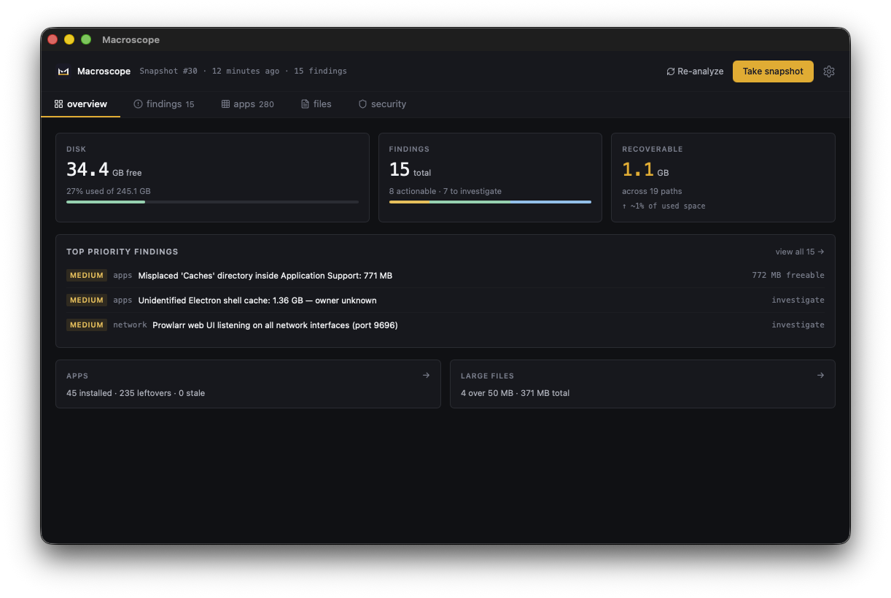
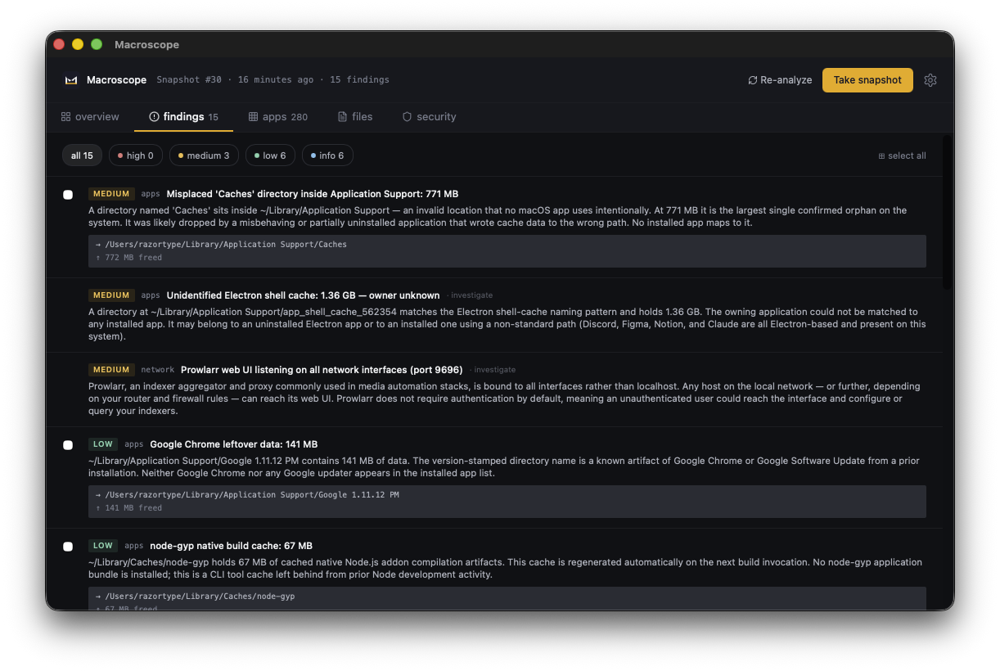
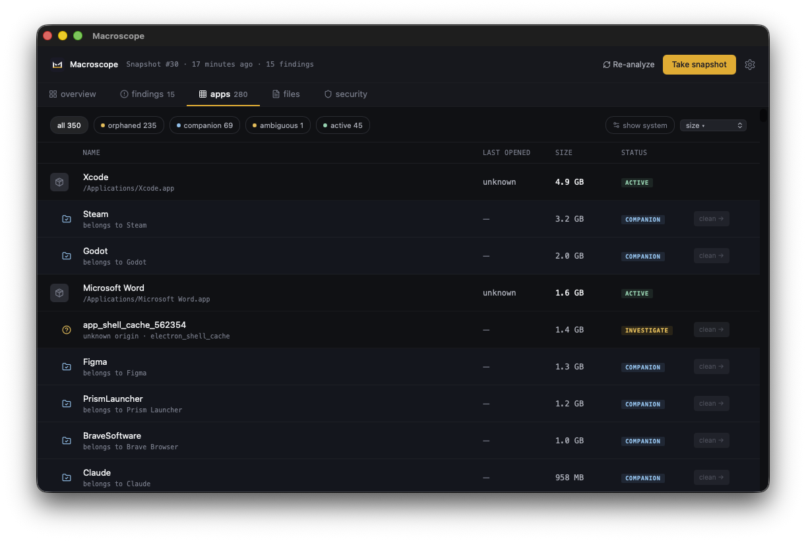
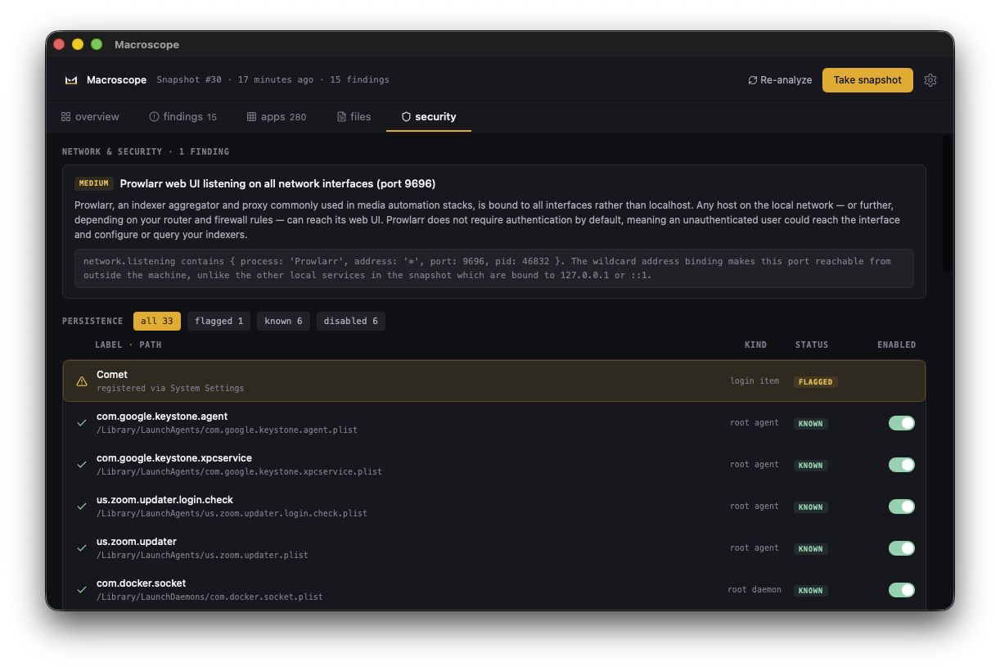
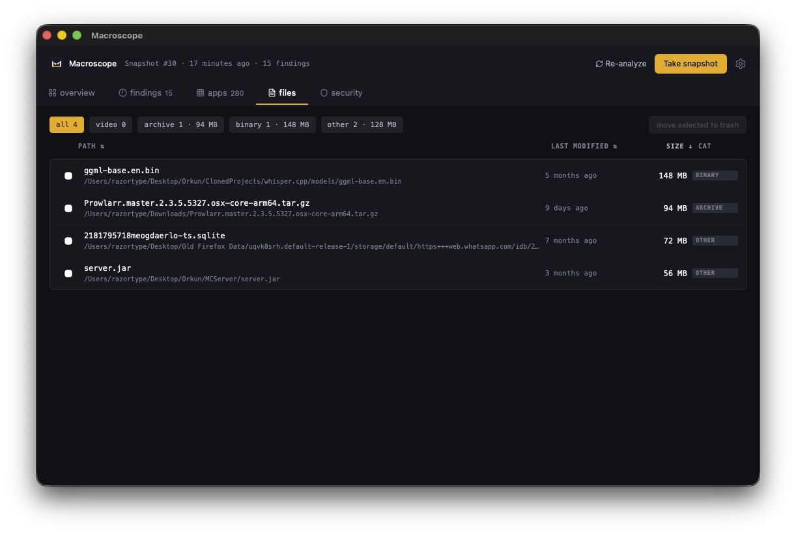

# Macroscope

> Local-first macOS system audit, powered by Claude.

## Origin

I kept seeing the same junk on my Mac for months. Cleaner apps either showed
me everything as "removable" without context, or buried real problems under
upsells. I trusted one of them once, clicked "clean," and lost a browser
profile I actually used. After that I stopped trusting them and started
reading `~/Library` by hand, which is fine for a weekend but not a habit.
So I built Macroscope. It runs locally, never deletes anything without
itemizing what it would touch first, and refuses to recommend cleaning data
that belongs to an app I still use.

Macroscope is a self-hosted desktop application that scans your Mac, runs a
deterministic identity graph over installed apps and their leftover data,
then uses local Claude Code CLI to surface findings. Everything stays on
your machine. No telemetry, no cloud upload, no account.

I built this because every commercial Mac cleaner I tried lied to me about
what was safe to delete. Macroscope refuses to recommend deleting data that
belongs to an installed app, refuses to touch protected system locations,
and asks for explicit confirmation per item before any destructive action.



## What it does

- **Snapshot your system**: 8 parallel Rust probes capture disk usage,
  installed apps, running processes, persistence entries, network listeners,
  and large files in roughly 15 seconds.
- **Classify with identity**: every leftover directory is matched against
  installed apps via bundle ID, vendor aliases, and display name. Results
  are marked as orphaned (safe to delete), companion (belongs to a running
  app, blocked), ambiguous (unknown origin, needs investigation),
  system-managed (macOS service, hidden), or self (Macroscope's own data,
  hidden).
- **Get AI findings**: three parallel Claude audits (disk, security, app
  lifecycle) read the structured snapshot and produce prioritized findings
  with severity, rationale, and concrete recommendations.
- **Review before executing**: every cleanup action goes through a preview
  modal that itemizes every path, classifies each by safety, and refuses
  destructive actions on companion / system / protected paths regardless
  of user intent.
- **See what changed**: snapshot history persists across restarts; cleaned
  items stay marked even after the app closes.



## Identity-aware classification

Most cleaners blindly list every directory under `~/Library/Application
Support` as a leftover. Macroscope cross-references each entry against the
list of installed `.app` bundles using:

1. Bundle ID last-segment match (`com.brave.Browser` → directory `Browser`)
2. Vendor alias lookup (`brave` → `BraveSoftware`)
3. Display name match (case-insensitive)
4. Executable name match
5. System-managed whitelist (`SiriTTS`, `contactsd`, `GeoServices`, etc.)
6. Electron shell-cache pattern (`app_shell_cache_<digits>`)

A directory that maps to a currently installed app is companion data, not a
leftover. Companion data appears in the Apps tab with a disabled clean
button and a clear "belongs to X" label.



## Safety model

Three layers prevent accidental destruction:

- **Allowlist** is computed from your configured project roots plus a fixed
  set of standard macOS cache locations. Anything outside is not eligible
  for cleanup.
- **Denylist** is absolute and never overrideable: `/`, `~/Documents`,
  `/System`, `/Library`, `/usr`, `/bin`, `/sbin`, `~/Library/Mobile
  Documents` (iCloud).
- **Preview modal** itemizes every target path, classifies each, and only
  enables execution for paths in the safe-to-delete section. Companion,
  system-managed, protected, and ambiguous paths are shown in the will-be-
  skipped section, unexecutable.

The Trash is the only destination. Macroscope never `rm -rf`. Items can be
restored via macOS Finder until you empty the Trash yourself.



## Persistence audit

Macroscope reads `/Library/LaunchAgents`, `/Library/LaunchDaemons`, and
their user-level counterparts, classifies each entry as known, normal,
flagged, or disabled, and surfaces toggles for user-actionable items.
Disabling a root daemon runs `sudo launchctl disable` through an
osascript-driven password prompt. Status persists across snapshots.

## File audit

Files over 50 MB anywhere in scanned roots are categorized (video, archive,
binary, other) and surfaced in the Files tab. Build artifacts in project
roots (`node_modules`, `target`, `.venv`, etc.) are reachable by the
allowlist but only the snapshot makes them visible; nothing is auto-deleted.



## Requirements

- macOS Sequoia (15.x) or later on Apple Silicon. Intel and earlier macOS
  versions are untested.
- Claude Code CLI installed and authenticated. Macroscope uses your local
  CLI subprocess and inherits your Claude Code subscription; no API key is
  passed.
- Around 200 MB of free disk for the application and its SQLite snapshot
  store.

See CONSTRAINTS.md for a complete list of platform and scope assumptions.

## Install

Macroscope is currently distributed as source. Auto-update and signed
releases are not provided.

```bash
git clone https://github.com/Razortype/macroscope.git
cd macroscope
npm install
cd src-tauri && cargo build --release && cd ..
npm run tauri build
```

The bundled app appears at `src-tauri/target/release/bundle/macos/
Macroscope.app`. Drag it into Applications.

First launch will silently auto-detect your project root directories
(`~/Code`, `~/Projects`, `~/Desktop/*/Projects`, etc.) and populate the
allowlist. You can edit project roots from Settings at any time.

## Usage

1. Click **Take snapshot** in the top right.
2. Wait roughly two minutes for the local probes and three Claude audits
   to complete. The progress UI streams stage-by-stage.
3. Browse the tabs:
   - **Overview**: disk capacity, findings count, recoverable estimate,
     last analysis stats, top priority findings.
   - **Findings**: prioritized AI-generated findings with severity badges.
   - **Apps**: every detected app and leftover, classified by identity
     status. Filter by orphaned, companion, ambiguous, or active.
   - **Files**: large files in scanned roots with category filters.
   - **Security**: network listeners and persistence entries with toggles
     for disabling user-actionable daemons.
4. Select findings in the Findings tab and click **Execute selected** to
   open the preview modal. Review every path, opt into companion items
   individually if you want them included, then execute. Only items in
   the safe section are deleted (moved to Trash).
5. Cleaned items are recorded; subsequent snapshots will not re-suggest
   them.

## Architecture

- **Frontend**: React 19 + TypeScript + Vite 7 + Tailwind v4 + TanStack
  Query, shadcn/ui components.
- **Backend**: Rust + Tauri v2, SQLite for snapshot persistence, walkdir
  for filesystem traversal, the `trash` crate via `NsFileManager` for
  trash operations.
- **AI**: local Claude Code CLI subprocess invoked with `claude -p
  --output-format=stream-json --verbose`. Token usage and cache hits are
  captured per audit and displayed in the analysis progress.
- **Identity graph**: a Rust module that runs after the apps probe and
  before the analyzer, classifying every leftover directory deterministically.

## License

AGPL-3.0. See LICENSE for full text.

## Status

Macroscope is at v0.1.0. It works on my machine and the macOS systems I
have access to. Issues and pull requests welcome.
